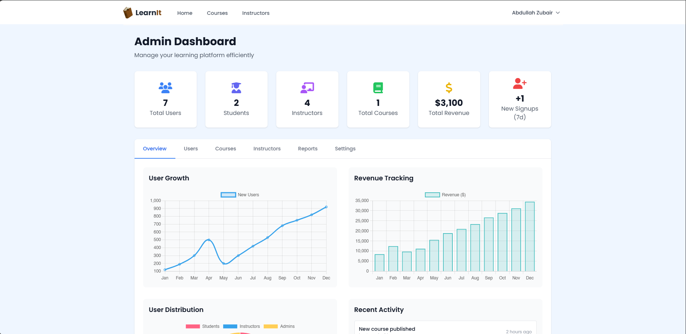
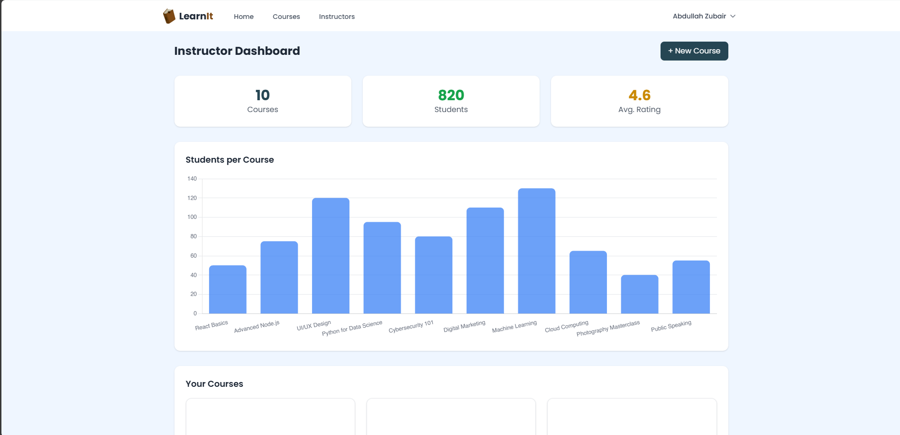
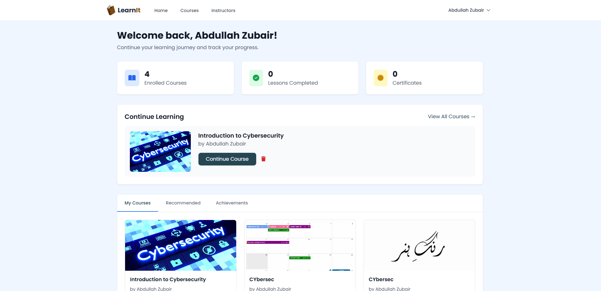
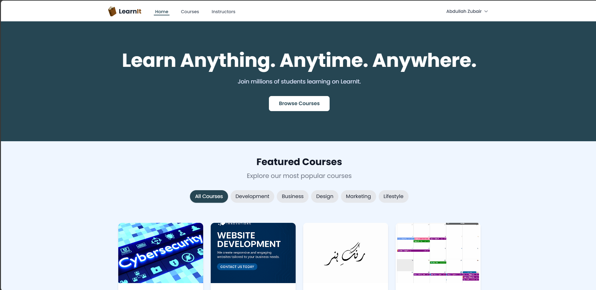

# LearnIt | MERN Stack Learning Platform

A full-stack **MERN (MongoDB, Express, React, Node.js)** application for managing online courses with role-based dashboards for **Admins, Instructors, and Students**.  

---

## 📑 Table of Contents
1. [Overview](#-overview)  
2. [Tech Stack](#-tech-stack)  
3. [Features](#-features)  
4. [Security Features](#-security-features)  
5. [Screenshots](#-screenshots)  
6. [Installation & Setup](#%EF%B8%8F-installation--setup)  
7. [Dependency Management](#-dependency-management)  
8. [Author](#%E2%80%8D-author)
9. [License](#-license)  

---

## 📖 Overview
LearnIt is an e-learning platform that allows:
- **Admins** to manage courses, users, and instructors.  
- **Instructors** to create and manage their own courses.  
- **Students** to register, enroll in courses, and watch course content with a built-in video player.  

---

## 🛠 Tech Stack
- **Frontend:** React, React Router, Axios, CSS, TailwindCSS, Bootstrap, Formspree  
- **Backend:** Node.js, Express.js  
- **Database:** MongoDB (Mongoose ODM)  
- **Authentication:** JWT (JSON Web Tokens)  
- **Other Tools:** dotenv, bcrypt, express-rate-limit, multer, morgan  

---

## 🚀 Features
- Role-based dashboards (Admin / Instructor / Student)  
- User authentication (Login / Register)  
- Course management (create, update, delete, enroll)  
- Video player integration for lessons  
- Admin dashboard for managing instructors and settings  
- Contact and Careers forms powered by **Formspree**  

---

## 🛡 Security Features
- **JWT Authentication** → Secures routes & user sessions.  
- **Rate Limiting** → Protects APIs from brute-force attacks.  
- **Environment Variables** → Sensitive data stored in `.env`.  
- **Role-based Access Control** → Separate dashboards & permissions.  
- **Secure File Uploads** → Organized uploads folder for course files/images.  

---

## 🖼 Screenshots

| Dashboard | Screenshot |
|-----------|------------|
| Admin Dashboard |  |
| Instructor Dashboard |  |
| Student Dashboard |  |
| Landing Page |  |

---

## ⚙️ Installation & Setup

### 1️⃣ Clone the Repository
```bash
git clone https://github.com/avatarparzival/learnit.git
cd learnit
```

### 2️⃣ Install Dependencies
#### Backend
```bash
cd server
npm install
```

#### Frontend
```bash
cd ../client
npm install
```

### 3️⃣ Setup Environment Variables

#### Backend (`/server/.env`)
```env
MONGO_URI=your_mongodb_connection_string
JWT_SECRET=your_jwt_secret
PORT=5000
```

#### Frontend (`/client/.env`)
```env
REACT_APP_API_BASE_URL=http://localhost:5000
REACT_APP_FORMSPREE_CAREERS=your_formspree_careers_form_id
REACT_APP_FORMSPREE_CONTACT=your_formspree_contact_form_id
```
- `REACT_APP_API_BASE_URL` → points to your backend API (local or production).  
- `REACT_APP_FORMSPREE_CAREERS` → Formspree endpoint for job applications / career form.  
- `REACT_APP_FORMSPREE_CONTACT` → Formspree endpoint for the general contact form.  
🔗 Get these values from your **Formspree dashboard** after creating forms.  

### 4️⃣ Start MongoDB
Make sure MongoDB is installed and running.  
On most systems:
```bash
mongod
```
Or if using MongoDB Compass/Atlas, ensure the cluster/connection is live.

### 5️⃣ Run the App
Open **two terminals**:

#### Run Backend
```bash
cd server
npm start
```

#### Run Frontend
```bash
cd client
npm start
```

Now visit 👉 `http://localhost:3000`

---

## 📦 Dependency Management
- Dependencies are split into **server/** and **client/**.  
- Always run `npm install` separately in both folders.  
- `package.json` uses `^` version ranges, so newer minor/patch updates will install automatically.  
- If you want to **lock exact versions** for reproducibility, run `npm install <package>@<version> --save` to update `package.json`.  

---

## 👨‍💻 Author
**Your Name**  
📧 abdullah69zubair@gmail.com  
🔗 [GitHub](https://github.com/avatarparzival)  

---

## 📜 License
This project is licensed under the **MIT License** — see the [LICENSE](LICENSE) file for details.  
